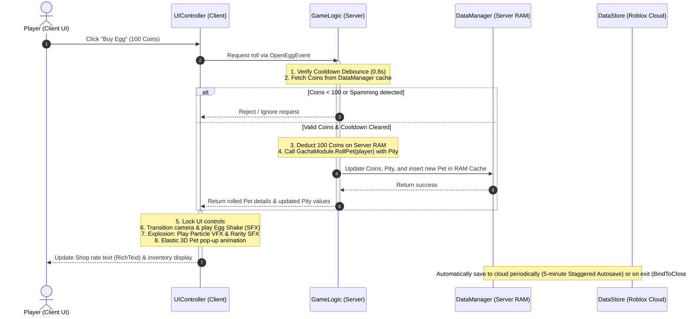
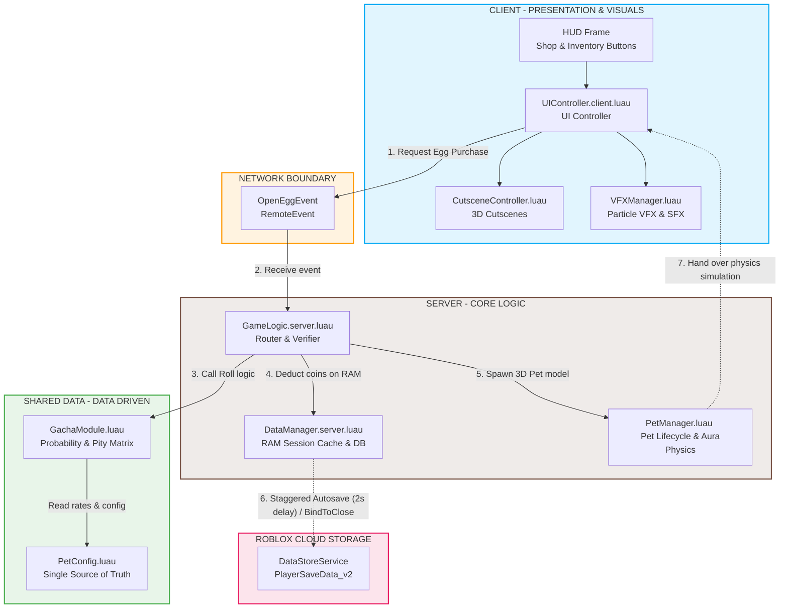

# Technical Documentation: Roblox Pet Gacha & Follow System

**English** | [Tiếng Việt](README_VI.md)

This project is a technical capability test for a Roblox Gameplay Developer. It implements a complete gameplay system featuring egg Gacha, inventory management, pet equipping, lag-free constraint-based follow physics, and robust server-authoritative security validations.

---

## 🔗 Project Resource Links (Quick Links)

* **Video Demo:** [YouTube](https://youtu.be/AtLpD9-X1p4)
* **Source Code:** [GitHub](https://github.com/Sang-GameStudio/gachapet-roblox)
* **Architecture Diagram:** [Google Drive Draw.io](https://drive.google.com/file/d/1FGgBzuLqnX_ZK_xYuepjx5m1ruFwZLuD/view?usp=sharing) or view directly at [Section II.3](#3-system-architecture-diagram)
* **UI Design:** [Figma](https://www.figma.com/design/wq9Vi0MmetB7mxZuE4Ke3A/-Roblox---GachaPet?node-id=0-1&t=Yxb2LYC5m82kQ3hx-1)
* **Implementation Plan:** [Google Docs](https://docs.google.com/document/d/1YcupYS4-5Xi90fmLho4k9iSuRRGZh_Fp7SCAeA0GUeI/edit?usp=sharing)

---

## I. Core Game-Loop Overview

1. **Player Entry:** The system retrieves user save files from Roblox DataStore. New players are granted 100,000 Coins for testing and start with a default pet (`Common1`) pre-equipped.
2. **Pet Follow System:** The equipped pet floats dynamically behind the player's shoulder, using Roblox physics constraints.
3. **HUD & Shop UI:** Clicking the Shop HUD button triggers a smooth Elastic Tween to scale up the shop interface.
4. **Egg Gacha Roll:** Rolling an egg costs 100 Coins. Upon purchase, the camera shifts to a secluded sky coordinate, playing an egg-shake cutscene, a particle explosion (VFX), and rarity-based congratulatory audio (SFX), before awarding the pet.
5. **Inventory UI:** Players open their inventory to view owned pets, grouped by quantity (`xN`) and sorted by rarity. Clicking a pet equips or unequips it instantly.

---

## II. System Architecture & Directory Structure

### 1. Rojo Directory Mapping (Workspace vs Roblox Explorer)

Source code is developed on an external IDE and synchronized to Roblox Studio using **Rojo**:

```
📁 project
├── 📁 src
│   ├── 📁 client                        -- Runs on Client (LocalScripts)
│   │   ├── 📜 init.client.luau          -- Entry point (initializes background music, HUD)
│   │   ├── 📜 UIController.client.luau  -- UI click listeners, Tween animation, Viewport 3D rendering
│   │   ├── 📜 CutsceneController.luau   -- 3D sky egg-open cutscene handling
│   │   └── 📜 VFXManager.luau           -- Particle configurations based on rarity
│   │
│   ├── 📁 server                        -- Runs on Server (Server Scripts)
│   │   ├── 📜 init.server.luau          -- Server initialization
│   │   ├── 📜 DataManager.server.luau   -- DataStore operations, RAM cache, Staggered Autosave loop
│   │   └── 📜 PetManager.luau           -- Lifecycle, constraints, and Aura setup for pets
│   │   └── 📜 GameLogic.server.luau     -- Remote event routers, purchase/equip validation
│   │
│   └── 📁 shared                        -- Shared by Client & Server
│       ├── 📜 PetConfig.luau            -- Single Source of Truth (rarity weight, aura Asset IDs)
│       └── 📜 GachaModule.luau          -- Weighted random logic & pity calculations
│
├── 📜 default.project.json             -- Rojo synchronization configuration
└── 📜 README.md                         -- Project technical document
```

### 2. Sequence Diagram: Gacha Egg Roll Flow

This Mermaid sequence diagram illustrates the client-server network communications when rolling an egg:



### 3. System Architecture Diagram

This diagram displays the decoupling of layers between Client and Server, showcasing the structural relationships of core modules:



---

## III. Key Technical Decisions

### 1. Separation of Concerns (SOLID - Single Responsibility Principle)
* **`GameLogic.server.luau`** is kept lightweight, acting strictly as a network **Router**. It listens to remote events, validates conditions (coins check, debounce check), and forwards tasks to specialized modules.
* **`PetManager.luau`** independently handles the physical lifecycles of pets: creation/deletion of models, setting physical Attachment coordinate anchors, and rotating client-synchronized auras.
* **`PetConfig.luau`** serves as a unified configuration database for pets (mapping name to rarity, inventory backgrounds, and custom aura decal IDs), allowing the game to scale without modifying core code (Open/Closed Principle).

### 2. Physics Optimization & Motion Jitter Elimination
* **Network Ownership:** The physics simulation of the follow pet is delegated from the Server to the owning player's Client using `petRoot:SetNetworkOwner(player)`. This ensures 100% latency-free follow motion (eliminating network lag/rubberbanding) and reduces server CPU calculation overhead.
* **Massless Parts:** All structural visual components of the pet and the magical aura pedestal are configured with `Massless = true` and `CanCollide = false`. This completely strips weight from the follower, preventing the physical constraints from dragging down or shoving the player character.

### system-design-assumptions">3. System Design Assumptions (Boundary Settings)
To keep this test project clean and self-contained, the following system limits have been established:
* **Equip Limit:** Players are restricted to equipping only 1 pet trailing behind them at a time.
* **Inventory Stacking:** Duplicate pets are grouped (Stacked) as a single grid element displaying `xN` quantity inside the inventory cache instead of creating multiple slots. This keeps the DataStore payload lightweight.
* **Currency Ceiling:** Player Coins are capped at 99,999,999 on the Server to avoid Integer Overflow errors in data handling.

---

## IV. Security & Exploit Protection (Server-Authoritative)

1. **Remote Event Anti-Spam (Throttle Filter):** Hackers using script execution tools could trigger `OpenEggEvent` hundreds of times per second to crash the server or buy infinite pets. The server implements a cooldown tracking dictionary `lastPurchaseTime[userId]` enforcing a strict `GACHA_COOLDOWN = 0.8s`. Spam requests are instantly ignored.
2. **Server-Authoritative Variables:** Client coin HUD text can be easily modified locally by hackers. Consequently, the server never respects currency values sent from the client. When an egg is purchased, the server calculates coin deduction directly against its RAM Session cache.
3. **RAM Cache & Staggered Autosave:** Calling database operations on Roblox Cloud is rate-limited. To prevent rate limit exhaustion, player data changes are cached in RAM (`sessionData`) and flushed to cloud storage in a **Staggered Autosave loop (delaying 2 seconds between player writes)**. A robust `game:BindToClose` routine guarantees that cache flushes occur safely during server shutdowns or crashes.

---

## V. Advanced Features & Extensibilities

The project implements several advanced systems matching professional production guidelines to optimize visuals, secure networking, and protect database limits:

| Advanced Feature | Algorithm & Production Value | Implementation Script File / Location |
| :--- | :--- | :--- |
| **1. Dynamic Pity System** | Multi-tier pity counts. If a player fails to roll a Rare pet $\ge$ 5 times, Rare rate rises to 35%. Failing to roll a Legendary $\ge$ 10 times increases Legendary rate to 25%. Hard Pity triggers at 8 (Rare) and 15 (Legendary) misses, forcing a 100% drop rate. | 📁 `src/shared/GachaModule.luau`<br/>↳ Function `GachaModule.RollPet()` |
| **2. Real-Time UI Pity Sync** | The rate display panel dynamically formats and highlights percentages using RichText (`#FFD700` for boosted Rare rates, `#FF5555` for Legendary) in real time when pity modifiers trigger. | 📁 `src/client/UIController.client.luau`<br/>↳ Function `updateRatePanelUI()` |
| **3. Weld Rotating Aura** | Creates a spinning magical pedestal under the pet using a physical `Weld` joint. The server updates the weld's `C0` rotation matrix inside a `RunService.Heartbeat` cycle at **60 degrees/second**, maintaining a smooth spin. | 📁 `src/server/PetManager.luau`<br/>↳ Functions `Init()` & `applyCustomAuraToPet()` |
| **4. Asset Preloading (GPU/VRAM)** | Invokes `ContentProvider:PreloadAsync()` on startup to cache sound SFX files, aura textures, and inventory borders directly into GPU VRAM, eliminating visual lag during game sessions. | 📁 `src/client/UIController.client.luau`<br/>↳ Function `preloadAssets()` on startup |
| **5. Anti-Remote Exploit Filter** | Server-side cooldown index `lastPurchaseTime` enforces a strict purchase gap. | 📁 `src/server/GameLogic.server.luau`<br/>↳ Connection `OpenEggEvent.OnServerEvent` |
| **6. Server-Authoritative Currency Check** | Verifies and updates user data directly from server RAM cache before validating transactions. | 📁 `src/server/GameLogic.server.luau`<br/>↳ Purchase handler block |
| **7. Staggered DB Save Loop** | Saves cached session data asynchronously with a 2-second stagger gap between players to prevent DataStore exhaustion. | 📁 `src/server/DataManager.server.luau`<br/>↳ `startAutosaveLoop()` & `BindToClose` |
| **8. Rarity Particles (VFX) & Audio (SFX)** | Integrates bright particle emitters into the follow pedestal. Emits custom explosive particle bursts and custom sound congratulations depending on the rarity (Common, Rare, Legendary). | 📁 `src/server/PetManager.luau` (aura structure)<br/>📁 `src/client/VFXManager.luau` (VFX logic)<br/>📁 `src/client/CutsceneController.luau` (SFX logic) |
| **9. Rarity-Based Inventory Slot BG** | Inventory frames dynamically update cell frame borders and backgrounds based on pet rarity (Common: light sand, Rare: purple, Legendary: gold) for clean item tiering. | 📁 `src/client/UIController.client.luau`<br/>↳ `refreshInventoryUI()` using `PetConfig.RARITY_BG` |
| **10. Intelligent Inventory Sorting** | Automatically sorts inventory cells by rarity weight first (Common $\rightarrow$ Rare $\rightarrow$ Legendary). Ties are broken alphabetically by name (e.g., `Common1` before `Common2`). | 📁 `src/client/UIController.client.luau`<br/>↳ `refreshInventoryUI()` using `table.sort` |

---

## VI. Review & Future Improvements

* **Ambiguity Resolution (Unequip Mechanic):** The prompt did not specify how a player unequips a pet. The system resolves this by allowing players to click an already `[Equipped]` pet cell in the inventory. This triggers an unequip request, destroying the workspace model and returning the character to walk normally.
* **Scalability Path (Pet Combiner):** If extended to a commercial project, a **"Pet Combining/Crafting"** system could be added (e.g., merging 5 duplicate Common pets to craft 1 Rare pet). This would help clear user inventory clutter and stimulate the in-game economy.
