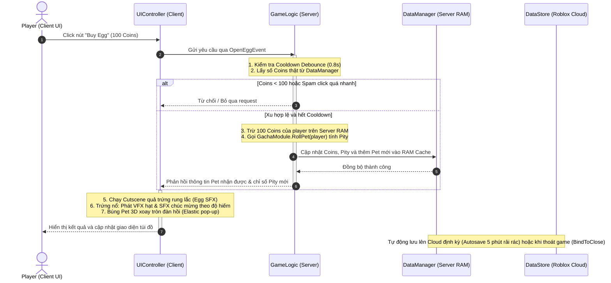
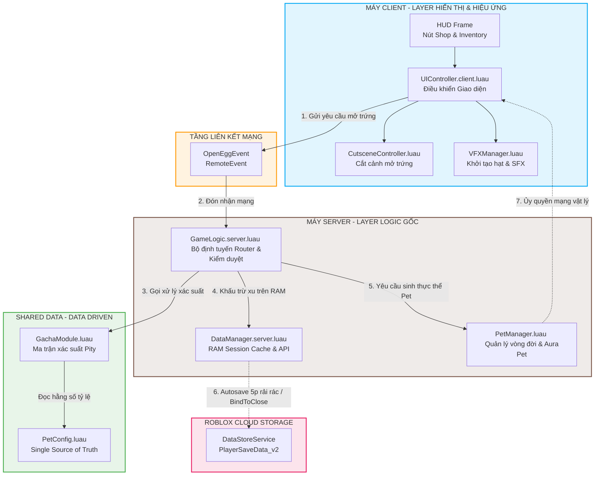

# Tài liệu Kỹ thuật Dự án Roblox Pet Gacha & Follow System

## 🔗 Liên kết Tài nguyên Dự án (Quick Links)

* **Video Demo:** [YouTube](https://youtu.be/AtLpD9-X1p4)
* **Mã nguồn dự án:** [GitHub](https://github.com/Sang-GameStudio/gachapet-roblox)
* **Sơ đồ Kiến trúc:** [Google Drive Draw.io](https://drive.google.com/file/d/1FGgBzuLqnX_ZK_xYuepjx5m1ruFwZLuD/view?usp=sharing) hoặc xem trực tiếp tại [Mục II.3](#3-sơ-đồ-kiến-trúc-hệ-thống-tổng-quan-system-architecture-diagram)
* **Bản thiết kế UI:** [Figma](https://www.figma.com/design/wq9Vi0MmetB7mxZuE4Ke3A/-Roblox---GachaPet?node-id=0-1&t=Yxb2LYC5m82kQ3hx-1)
* **Kế hoạch Triển khai:** [Google Docs](https://docs.google.com/document/d/1YcupYS4-5Xi90fmLho4k9iSuRRGZh_Fp7SCAeA0GUeI/edit?usp=sharing)

---

## I. Tổng quan Core Game-Loop

1. **Người chơi vào game:** Hệ thống tải dữ liệu từ DataStore, nếu là người chơi mới sẽ được cấp 100,000 Coins để test và trang bị sẵn Pet mặc định (`Common1`).
2. **Bám đuôi nhân vật:** Chú Pet được trang bị sẽ di chuyển lơ lửng theo sát bên vai người chơi bằng liên kết vật lý.
3. **HUD & Shop UI:** Người chơi bấm nút mở Shop trên HUD, giao diện Shop xuất hiện phóng to bằng hiệu ứng Elastic Tween mượt mà.
4. **Mở trứng Gacha:** Bấm nút mua trứng tiêu tốn 100 Coins. Camera sẽ di chuyển lên tọa độ trời xanh tách biệt, thực hiện cutscene quả trứng rung lắc (shake), nổ tung phát hiệu ứng hạt (VFX) và nhạc chúc mừng (SFX) theo độ hiếm tương ứng rồi cộng Pet vào túi đồ.
5. **Inventory UI:** Mở Inventory để quản lý danh sách Pet sở hữu (được nhóm số lượng `xN` và sắp xếp theo độ hiếm). Nhấp vào Pet để trang bị hoặc hủy trang bị ngay lập tức.

---

## II. Sơ đồ Kiến trúc & Cấu trúc Thư mục

### 1. Bản đồ cấu trúc Rojo (Workspace vs Roblox Explorer)

Mã nguồn được phát triển hoàn toàn trên IDE bên ngoài và đồng bộ vào Roblox Studio thông qua công cụ **Rojo**:

```
📁 project
├── 📁 src
│   ├── 📁 client                        -- Chạy tại máy Client (LocalScripts)
│   │   ├── 📜 init.client.luau          -- Entry point khởi chạy nhạc nền, HUD
│   │   ├── 📜 UIController.client.luau  -- Quản lý click nút, Tween UI, render Viewport 3D
│   │   ├── 📜 CutsceneController.luau   -- Xử lý cắt cảnh mở trứng 3D ngoài vũ trụ
│   │   └── 📜 VFXManager.luau           -- Tải và cấu hình tia sáng, hạt nổ theo độ hiếm
│   │
│   ├── 📁 server                        -- Chạy tại máy Server (Server Scripts)
│   │   ├── 📜 init.server.luau          -- Khởi tạo server
│   │   ├── 📜 DataManager.server.luau   -- Quản lý DataStore, RAM cache, Staggered Autosave
│   │   └── 📜 PetManager.luau           -- Module quản lý vòng đời, vật lý và Aura của Pet
│   │   └── 📜 GameLogic.server.luau     -- Server Script nhận mạng Remote, validate điều kiện mua/trang bị
│   │
│   └── 📁 shared                        -- Dùng chung cho cả Client & Server
│       ├── 📜 PetConfig.luau            -- Single Source of Truth chứa cấu hình Pet, Rarity, AuraId
│       └── 📜 GachaModule.luau          -- Logic quay xác suất ngẫu nhiên và tính toán Pity
│
├── 📜 default.project.json             -- File cấu hình ánh xạ thư mục của Rojo
└── 📜 README.md                         -- Tài liệu kỹ thuật
```

### 2. Sơ đồ tuần tự: Luồng mở trứng Gacha (Sequence Diagram)

Sơ đồ Mermaid dưới đây mô tả chi tiết luồng giao tiếp mạng giữa Client và Server khi người chơi thực hiện thao tác mở trứng:



### 3. Sơ đồ Kiến trúc Hệ thống Tổng quan (System Architecture Diagram)

Sơ đồ khối dưới đây thể hiện mối quan hệ liên kết, phân tách trách nhiệm giữa các layer Client - Server và cách các hệ thống/tính năng cốt lõi giao tiếp với nhau trong dự án:



---

## III. Chi tiết các Quyết định Kỹ thuật chính

### 1. Phân tách trách nhiệm (SOLID - Single Responsibility Principle)
* **`GameLogic.server.luau`** được tinh giản tối đa, chỉ làm nhiệm vụ làm **Router** trung chuyển: đón nhận các RemoteEvent/RemoteFunction, kiểm duyệt quyền mua của người chơi (tiền xu, debounce), sau đó gọi sang các module chuyên biệt để xử lý.
* **`PetManager.luau`** độc lập quản lý vòng đời Pet: tạo/xóa model, tính toán điểm neo Attachment vật lý và định vị bệ hào quang Aura.
* **`PetConfig.luau`** lưu trữ tập trung toàn bộ cơ sở dữ liệu về Pet (độ hiếm, ảnh slot, bệ aura), giúp game dễ dàng scale lên hàng trăm loại pet chỉ bằng việc thêm dòng dữ liệu mà không cần sửa code cốt lõi (Open/Closed Principle).

### 2. Tối ưu hóa Vật lý & Triệt tiêu Lag chuyển động
* **Network Ownership:** Toàn bộ mô hình Pet bám đuôi được Server bàn giao quyền tính toán vật lý cho Client của người chơi sở hữu bằng phương thức `petRoot:SetNetworkOwner(player)`. Điều này giúp chuyển động của Pet mượt mà tuyệt đối 100%, không bị trễ hình ảnh (Network Lag) và giảm tải CPU xử lý vật lý cho Server.
* **Massless Parts:** Tất cả các bộ phận của Pet và bệ hào quang Aura trang trí đều được thiết lập `Massless = true` và `CanCollide = false`. Điều này triệt tiêu hoàn toàn khối lượng của Pet, tránh việc lực hút vật lý làm trĩu hoặc đẩy giật nhân vật khi di chuyển.

### 3. Các giả định thiết kế hệ thống (Assumptions)
Để xây dựng bài test này một cách khép kín và logic, các giả định biên sau đây đã được thiết lập:
* **Giới hạn trang bị:** Giả định tại một thời điểm, mỗi người chơi chỉ được phép trang bị duy nhất 1 chú Pet đi theo sau lưng.
* **Cơ chế lưu trữ trùng lặp:** Giả định hệ thống Inventory không lưu tách biệt các thực thể Pet giống nhau thành nhiều ô độc lập, mà tự động nhóm (Stack) lại theo số lượng `xN` để tối ưu dung lượng bộ nhớ gói tin DataStore.
* **Giới hạn tiền tệ:** Giả định Coins của người chơi được giới hạn tối đa là 99,999,999 để tránh lỗi tràn số dữ liệu (Integer Overflow) trên Server.

---

## IV. Giải pháp Bảo mật & Chống Exploit (Rất quan trọng)

1. **Chặn Spam Remote Event:** Hacker có thể sử dụng các phần mềm can thiệp (như Synapse X) để liên tục gọi `OpenEggEvent` hàng ngàn lần/giây nhằm làm sập server hoặc mua lố số trứng. Server thiết lập một bảng Cooldown `lastPurchaseTime` và kiểm duyệt thời gian trễ tối thiểu `GACHA_COOLDOWN = 0.8s`. Nếu khoảng cách giữa 2 click nhỏ hơn 0.8s, server sẽ lập tức hủy bỏ giao dịch.
2. **Server-Authoritative (Server làm gốc):** Số dư Coins hiển thị trên UI Client hoàn toàn có thể bị hack sửa đổi giá trị. Do đó, Server tuyệt đối không sử dụng dữ liệu tiền xu từ Client gửi lên. Mỗi khi mua trứng, Server sẽ tự truy xuất dữ liệu Coins thực từ RAM Cache trên Server để xác thực giao dịch.
3. **RAM Cache & Staggered Autosave:** Để tránh giới hạn băng thông truy cập mạng Cloud DataStore của Roblox (Rate Limit), hệ thống sử dụng RAM Cache `sessionData` lưu trữ tạm thời và thực hiện lưu trữ xuống Cloud định kỳ bằng vòng lặp **Autosave rải rác (Delay 2 giây giữa mỗi Player)**. Logic `game:BindToClose` đảm bảo dữ liệu luôn được lưu an toàn trước khi server sập hoặc tắt server bảo trì.

---

## V. Các Tính năng Nâng cao & Sáng tạo mở rộng (Khung điểm Ưu tiên từ Đề bài)

Dự án đã được chủ động phát triển toàn diện các giải pháp bảo mật, tối ưu hóa hệ thống dữ liệu lớn và hiệu ứng hình ảnh nằm trong danh mục "Khuyến khích & Ưu tiên" của đề bài nhằm đạt tiêu chuẩn Production-Ready. Dưới đây là bảng tra cứu tính năng và vị trí mã nguồn xử lý thực tế:

| Tính năng nâng cao | Giải thuật & Giá trị thực chiến mang lại | Vị trí File / Script triển khai thực tế |
| :--- | :--- | :--- |
| **1. Hệ thống bảo hiểm kép (Dynamic Pity)** | Tự động tăng tỷ lệ Rare lên 35% ở lần 5 hụt, Legendary lên 25% ở lần 10 hụt. Ép chết 100% trúng (Hard Pity) lần lượt ở mốc 8 và 15 lần hụt để bảo vệ tâm lý người chơi. | 📁 `src/shared/GachaModule.luau`<br/>↳ Hàm `GachaModule.RollPet()` |
| **2. UI Real-Time Sync (RichText)** | Bảng hiển thị xác suất trong Shop tự động nhuộm màu động cho ký tự `%` (`#FFD700` cho Rare, `#FF5555` cho Legendary) theo thời gian thực khi kích hoạt Pity mà không làm chật bố cục UI. | 📁 `src/client/UIController.client.luau`<br/>↳ Hàm `updateRatePanelUI()` |
| **3. Bệ hào quang xoay (Rotating Aura)** | Tạo bệ ma thuật độc bản dưới chân Pet bằng khớp nối `Weld`, tính toán ma trận `C0` xoay tròn mượt mà 360 độ trên Server thông qua `RunService.Heartbeat`, triệt tiêu trọng lượng bằng Massless. | 📁 `src/server/PetManager.luau`<br/>↳ Hàm `PetManager.Init()` & `applyCustomAuraToPet()` |
| **4. Tải trước tài nguyên (Asset Preload)** | Gọi `ContentProvider:PreloadAsync()` chạy ngầm ngay khi vào game để nạp sẵn toàn bộ ID âm thanh SFX, Texture Aura và khung ảnh Slot UI vào bộ nhớ VRAM của GPU, triệt tiêu độ trễ mạng. | 📁 `src/client/UIController.client.luau`<br/>↳ Hàm `preloadAssets()` gọi khi tải Game |
| **5. Chặn Spam mạng (Anti-Remote Exploit)** | Thiết lập bộ lọc Cooldown `lastPurchaseTime` và kiểm duyệt thời gian trễ tối thiểu `GACHA_COOLDOWN = 0.8s` trên Server. Hủy bỏ ngay các request mua trứng liên tục từ Tool/Script Hack. | 📁 `src/server/GameLogic.server.luau`<br/>↳ Sự kiện `OpenEggEvent.OnServerEvent` |
| **6. Xác thực gốc dữ liệu (Server-Authoritative)** | Triệt tiêu rủi ro hacker can thiệp sửa đổi giá trị Coins hiển thị trên UI Client. Mỗi khi thực hiện Gacha, Server tự truy xuất và đối chiếu số dư trực tiếp trên RAM Server. | 📁 `src/server/GameLogic.server.luau`<br/>↳ Hàm xử lý kiểm tra `EGG_PRICE` |
| **7. RAM Session Caching & Autosave** | Lưu dữ liệu phiên chơi trên bảng `sessionData` RAM Server đạt tốc độ 0ms. Tự động lưu rải rác xuống Cloud (Staggered Autosave nghỉ 2 giây giữa mỗi Player) giúp chống lỗi nghẽn DataStore Rate Limit. | 📁 `src/server/DataManager.server.luau`<br/>↳ Hàm `startAutosaveLoop()` và `game:BindToClose` |
| **8. Hiệu ứng hạt & Âm thanh chúc mừng (VFX & SFX)** | Tích hợp hệ thống phát hạt ánh sáng `ParticleEmitter` lấp lánh đính kèm bệ Aura dưới chân Pet, kết hợp nhạc chúc mừng (SFX) riêng biệt phát khi trúng Pet tương ứng theo độ hiếm (Common, Rare, Legendary). | 📁 `src/server/PetManager.luau` ↳ Hàm `applyCustomAuraToPet()` (tạo bệ Aura)<br/>📁 `src/client/VFXManager.luau` ↳ Hàm `SetupVFX()` (hạt Gacha)<br/>📁 `src/client/CutsceneController.luau` ↳ Hàm `playSFX()` (âm thanh chúc mừng) |

---


## VI. Đánh giá đề bài & Điểm có thể cải thiện tiếp theo

* **Điểm đề bài chưa nêu rõ:** Đề bài chưa quy định cụ thể về cơ chế "Hủy trang bị Pet" (Unequip). Dự án đã chủ động giải quyết bằng cách: Khi người chơi nhấp vào một chú Pet đang ở trạng thái `[Equipped]`, hệ thống sẽ tự động hiểu là lệnh hủy trang bị, xóa Model Pet ngoài Workspace và đưa nhân vật về trạng thái đi bộ một cách mượt mà.
* **Hướng phát triển mở rộng trong thực tế:** Nếu dự án này được phát triển thành một sản phẩm thương mại thực tế, hệ thống có thể nâng cấp thêm tính năng **"Pet Combining/Gold Crafting"** (Dung hợp 5 con Pet Common trùng nhau để nâng cấp lên thành 1 con Pet Rare). Cơ chế này sẽ giúp dọn sạch rác Inventory cho người chơi khi họ cày cuốc quá lâu và kích thích nền kinh tế trong game vận hành ổn định hơn.

