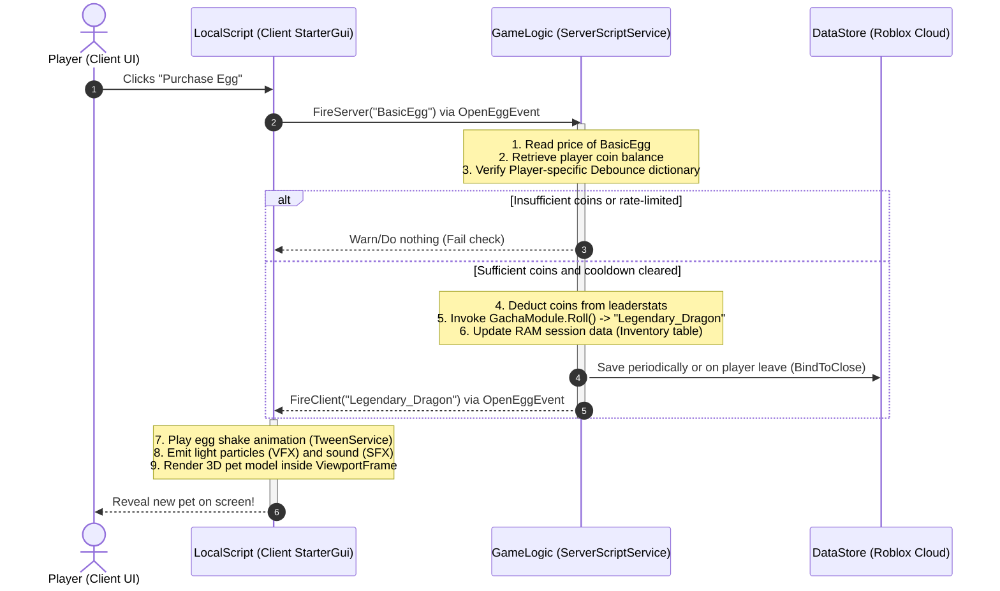

# Roblox Project Client-Server Architecture

This document describes the design decisions, file structure, and network architecture for the Roblox Egg Gacha & Pet project.

---

## 1. Directory Structure (Rojo Mapping)

The workspace is organized to support a Rojo-to-Roblox synchronisation flow:

```
📁 project
├── 📁 src
│   ├── 📁 client               -- Maps to StarterPlayer.StarterPlayerScripts.Client
│   │   └── 📜 init.client.luau  -- Entry point for client scripts, listens to UI button events
│   │
│   ├── 📁 server               -- Maps to ServerScriptService.Server
│   │   ├── 📜 DataManager.server.luau -- Server-authoritative inventory save/load via DataStoreService
│   │   ├── 📜 GameLogic.server.luau   -- Listens to Gacha/Equip Remote events, checks player coins/debounces
│   │   └── 📜 init.server.luau        -- Server initialization script
│   │
│   └── 📁 shared               -- Maps to ReplicatedStorage.Shared
│       ├── 📜 GachaModule.luau  -- Weighted random probabilities (Common 80%, Rare 15%, Legendary 5%)
│       ├── 📜 PetClass.luau     -- OOP Metatable representation of Pet instances
│       └── 📜 Hello.luau        -- Simple greeting module
│
├── 📜 default.project.json     -- Rojo configurations (maps files to ReplicatedStorage, ServerScriptService, etc.)
└── 📜 rojo.exe                 -- Rojo CLI utility to sync project files with Roblox Studio
```

---

## 2. Sequence Diagram: Egg Hatching (Gacha Core Loop)

This sequence diagram depicts how client interactions invoke server validation and database write, followed by local client visual rendering:



---

## 3. Network Boundaries & Exploit Prevention

| Operation | Client Role | Server Role (Authoritative) |
|---|---|---|
| **Egg Hatching** | Triggers UI request, plays egg shaking VFX/SFX. | Deducts coins, generates random roll, inserts item to server data cache. |
| **Equip Pet** | Triggers equip request by sending pet ID. | Validates that player actually owns the pet in server RAM, instantiates pet model, and binds physics constraints. |
| **Inventory View** | Renders 3D viewports from localized cache. | Reads from DataStore, returns clean tables via RemoteFunction. |
